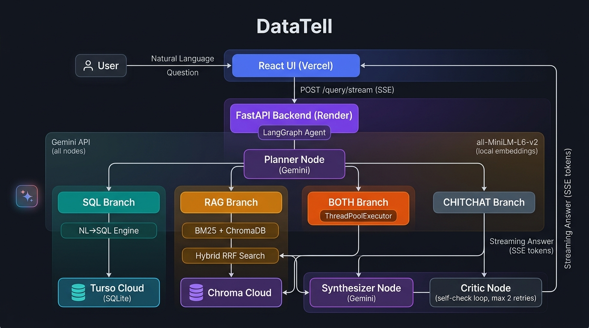

# DataTell

**Ask questions in plain English. Get answers backed by SQL and documents.**

DataTell is an agentic AI system that routes natural language questions to the right tool — SQL query, document retrieval, or both in parallel — then synthesizes a grounded answer with a self-check loop.

Built on the [Olist Brazilian E-Commerce dataset](https://www.kaggle.com/datasets/olistbr/brazilian-ecommerce) (549,874 rows across 7 tables).

> 🎓 Portfolio project demonstrating agentic RAG, NL→SQL, LangGraph routing, and hybrid search.

---

## Architecture



The system is a **LangGraph state machine** with 5 typed nodes:

```
User Question (natural language)
        │
        ▼
  Planner Node (Gemini)
  classify → SQL | RAG | BOTH | CHITCHAT
        │
   ┌────┴────────────────────┐
   │                         │
   ▼                         ▼
SQL Branch              RAG Branch
NL→SQL Engine           BM25 + ChromaDB
Turso Cloud ◄──────────► Chroma Cloud
(SQLite API)          (Hybrid RRF Search)
   │                         │
   └─────────┬───────────────┘
             ▼
      Synthesizer Node (Gemini)
             │
             ▼
       Critic Node ──── FAIL ──► retry (max 2)
             │
           PASS
             │
             ▼
    Streaming Answer (SSE tokens → React UI)
```

**BOTH route:** SQL and RAG run in parallel via `ThreadPoolExecutor` — the most impressive demo moment.

---

## Benchmarks

| Metric | Result | Target |
|---|---|---|
| NL→SQL accuracy | **20/20 (100%)** | ≥ 90% |
| Avg SQL attempts | **1.0** | ≤ 1.5 |
| Agent routing accuracy | **22/23 (95.7%)** | ≥ 85% |
| RAGAS Faithfulness | **0.9722** | > 0.80 |
| RAGAS Context Precision | **0.7738** | > 0.75 |
| RAG retrieval latency | **13–30 ms** | — |
| SQL route avg latency | **7.4 s** | — |
| RAG route avg latency | **5.7 s** | — |
| BOTH route avg latency | **11.5 s** (parallel) | — |

---

## Dataset

**Olist Brazilian E-Commerce** — real marketplace data, 2016–2018.

| Table | Rows | Description |
|---|---|---|
| `customers` | 99,441 | Customer locations |
| `orders` | 99,441 | Orders with status & timestamps |
| `order_items` | 112,650 | Line items with price & seller |
| `payments` | 103,886 | Payment method & value |
| `reviews` | 99,224 | Scores + free-text comments |
| `products` | 32,951 | Category, weight, dimensions |
| `sellers` | 3,095 | Seller locations |

---

## Project Phases

| Phase | Status | Description |
|---|---|---|
| 1 — Data Foundation | ✅ Done | Config-driven ETL: 7 CSVs → SQLite (dedup, date parsing, translation) |
| 2 — NL→SQL Engine | ✅ Done | Gemini + retry loop + SQLite authorizer safety layer — 20/20 test suite |
| 3 — RAG Pipeline | ✅ Done | ChromaDB + BM25 hybrid RRF search — 100% source retrieval accuracy |
| 4 — Agent Router | ✅ Done | LangGraph state machine — SQL/RAG/BOTH/CHITCHAT with parallel fan-out |
| 5 — Self-Check Loop | ✅ Done | Critic node — hallucination guard, retries synthesizer up to 2× |
| 6 — React Frontend | ✅ Done | Streaming SSE chat, reasoning trace panel, auto-rendered charts |
| 7 — Evaluation | ✅ Done | RAGAS: Faithfulness 0.97, Context Precision 0.77 |
| 8 — Docs & Deploy | ✅ Done | README, architecture diagram, Turso + Chroma Cloud, Render + Vercel |
| 9 — Bring Your CSV | 🔲 Stretch | User-uploaded CSV → auto-schema → all existing pipelines |

---

## Quick Start (Local)

### Prerequisites
- Python 3.11+
- Node.js 18+
- [Olist dataset](https://www.kaggle.com/datasets/olistbr/brazilian-ecommerce) CSVs in `data/raw/`
- Gemini API key (free at [aistudio.google.com](https://aistudio.google.com))

### Setup

```bash
# 1. Clone & install Python deps
git clone https://github.com/your-username/DataTell.git
cd DataTell
pip install -r requirements.txt

# 2. Set your API key
cp .env.example .env
# Edit .env and set GEMINI_API_KEY=your_key_here

# 3. Build the SQLite database
python scripts/load_data.py

# 4. Start the backend
python backend/api.py
# → API running at http://localhost:8000

# 5. In a new terminal — start the frontend
cd frontend
npm install
npm run dev
# → UI at http://localhost:5173
```

### Example Questions

```
# SQL route
"What are the top 10 product categories by total revenue?"
"How many orders were delivered late in São Paulo?"

# RAG route
"What is the return window for defective products?"
"What happens to sellers with consistently low review scores?"

# BOTH route (SQL + RAG in parallel)
"What are the top categories by revenue, and what's the return policy for each?"
"Which states have the most late deliveries, and what are the shipping guidelines?"
```

---

## Running the Test Suites

```powershell
# NL→SQL: 20 questions (100% pass)
python scripts/test_nl_to_sql.py

# RAG pipeline: 10 questions
python scripts/test_rag.py

# Full agent: 23 questions across all 4 routes
python scripts/test_agent.py

# Single question (interactive)
python scripts/agent_router.py "your question here"
```

---

## Deploy to Production (Render + Vercel)

### Step 1 — Set up cloud databases

**Turso (cloud SQLite)** — [turso.tech](https://turso.tech) — free tier: 5 GB, 500M reads/month

```bash
# Install Turso CLI and create a database
turso db create datatell

# Migrate all 549,874 rows
python scripts/migrate_to_turso.py
```

**Chroma Cloud (vector store)** — [trychroma.com](https://trychroma.com) — $5 free credits

```bash
# After signing up and getting credentials
python scripts/migrate_to_chroma_cloud.py
```

### Step 2 — Deploy backend to Render

1. Push this repo to GitHub
2. Go to [render.com](https://render.com) → **New Web Service** → connect repo
3. Render auto-detects `render.yaml` — set the following secret env vars in the dashboard:
   - `GEMINI_API_KEY`
   - `TURSO_DATABASE_URL`
   - `TURSO_AUTH_TOKEN`
   - `CHROMA_TENANT`
   - `CHROMA_API_KEY`

### Step 3 — Deploy frontend to Vercel

```bash
cd frontend
npx vercel --prod
# Set VITE_API_URL=https://datatell-api.onrender.com in Vercel dashboard
```

> **Note:** Render free tier sleeps after 15 min of inactivity — first request after sleep takes ~30–60s to wake up. This is normal for a free-tier portfolio demo.

---

## Project Structure

```
DataTell/
├── .env.example            # All required env vars with comments
├── render.yaml             # Render deployment config (backend)
├── requirements.txt        # Python dependencies
│
├── backend/
│   └── api.py              # FastAPI: /query and /query/stream (SSE) endpoints
│
├── docs/
│   └── architecture.png    # System architecture diagram
│
├── frontend/               # React + Vite chat UI
│   ├── vercel.json         # Vercel deployment config
│   ├── src/
│   │   ├── components/
│   │   │   ├── ChatInterface.jsx    # SSE streaming chat, multi-turn history
│   │   │   ├── ResultRenderer.jsx  # Auto-renders charts from SQL results
│   │   │   └── ReasoningTrace.jsx  # Sidebar: route, SQL, chunks, timing
│   │   └── index.css               # Dark/light theme, CSS variables
│   └── .env.example        # VITE_API_URL for Vercel
│
├── scripts/
│   ├── load_data.py            # Phase 1: ETL pipeline (config-driven)
│   ├── schema_utils.py         # Phase 2: get_schema(), format_schema_for_prompt()
│   ├── nl_to_sql.py            # Phase 2: NL→SQL (Gemini + retry + SQLite authorizer)
│   ├── rag_pipeline.py         # Phase 3: chunk/embed/index/retrieve/generate
│   ├── agent_router.py         # Phase 4+5: LangGraph agent (all 5 nodes)
│   ├── evaluate.py             # Phase 7: RAGAS evaluation
│   ├── migrate_to_turso.py     # Phase 8: local SQLite → Turso Cloud
│   ├── migrate_to_chroma_cloud.py  # Phase 8: local ChromaDB → Chroma Cloud
│   ├── test_nl_to_sql.py       # 20-question NL→SQL test suite
│   ├── test_rag.py             # 10-question RAG test suite
│   └── test_agent.py           # 23-question agent routing test suite
│
└── data/raw/               # Olist CSVs (gitignored — download from Kaggle)
```

---

## Key Design Decisions

### `load_resources(db_path, docs_dir, chroma_dir)` — fully parameterised
Every resource path is injectable. Phase 9 ("bring your own CSV") only needs a new `source_config` — zero changes to NL→SQL, RAG, or agent code.

### SQLite → Turso: zero SQL changes
`pyturso` is a drop-in `sqlite3` replacement. Every `conn.execute()` call in `nl_to_sql.py`, `schema_utils.py`, and `agent_router.py` works unchanged. The only change is how the connection is opened.

### Local embeddings (`all-MiniLM-L6-v2`)
Avoids Gemini API rate limits during indexing. 90 MB model, cached after first download, 384-dim dense vectors. Embeddings are pre-computed and stored — migration to Chroma Cloud reuses them without re-embedding.

### Hybrid search (BM25 + Vector → RRF)
Pure vector search misses exact terms ("Article 49", "30 calendar days"). BM25 catches keyword matches. Reciprocal Rank Fusion (k=60) combines both without a reranker. 100% source retrieval accuracy on the test suite.

### SQLite thread-safety in BOTH route
`both_tools_node` runs SQL and RAG in parallel via `ThreadPoolExecutor`. SQLite connections aren't thread-safe, so each thread opens a **fresh connection** to the DB path. Classic connection-per-thread pattern.

### Critic self-check loop
The critic evaluates whether the answer (a) directly addresses the question and (b) is grounded in the evidence. On FAIL, the critique is injected into the synthesizer's next prompt. Max 2 retries, then accept the best answer.

### Null handling philosophy
We **log** nulls, we don't blindly drop them. `order_delivered_customer_date = NULL` means the order hasn't arrived — that's real data. Only rows missing their *primary key* are dropped.

---

## License

MIT
